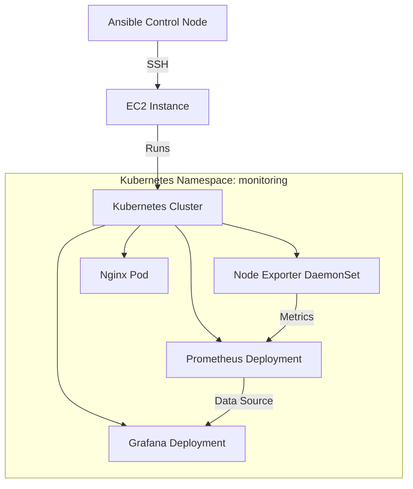

# Kubernetes Monitoring Stack Deployment with Ansible
## Architecture Overview



## Project Structure

```
ansible-testing/
├── ansible.cfg              # Ansible configuration
├── group_vars/
│   └── all.yml             # Common variables
├── host_vars/
│   └── 3.17.25.69.yml      # Host-specific variables
├── inventories/
│   ├── dev                 # Development environment
│   ├── prod               # Production environment
│   ├── qa                 # QA environment
│   └── staging            # Staging environment
├── playbooks/
│   ├── deploy_apps.yml    # Main deployment playbook
│   ├── deploy_monitoring.yml
│   └── site.yml
└── roles/
    ├── grafana/           # Grafana deployment
    ├── k8s_setup/         # Kubernetes setup
    ├── monitoring/        # Monitoring stack
    ├── nginx/            # Nginx deployment
    ├── node_exporter/    # Node metrics collector
    ├── prometheus/       # Metrics database
    └── python/          # Python environment setup
```

## Component Relationships

1. **Control Flow**:
   - Ansible Control Node → EC2 Instance (via SSH)
   - EC2 Instance → Kubernetes Cluster (via kubeconfig)
   - Kubernetes Cluster → Monitoring Stack Components

2. **Data Flow**:
   - Node Exporter → Prometheus (metrics collection)
   - Prometheus → Grafana (data visualization)
   - Nginx → Node Exporter (web metrics)

## Configuration Details

### 1. Ansible Configuration (ansible.cfg)
```ini
[defaults]
inventory = inventories/dev
host_key_checking = False
retry_files_enabled = False
roles_path = ./roles
remote_user = ec2-user
private_key_file = ~/.ssh/pratik-test.pem
```

### 2. Global Variables (group_vars/all.yml)
```yaml
k8s_packages:
  - docker
  - kubelet
  - kubeadm
  - kubectl
  - helm

kube_version: v1.29.3

# Component configurations
prometheus_values:
  scrape_interval: 15s
  node_exporter_target: localhost:9100

grafana_values:
  admin_user: admin
  admin_password: admin
  service_type: NodePort
  service_port: 3000
```

## Deployment Flow

1. **Infrastructure Preparation**:
   - EC2 instance setup with required SSH access
   - Installation of base dependencies

2. **Kubernetes Setup**:
   - Installation of Kubernetes components
   - Cluster initialization
   - Network plugin setup

3. **Monitoring Stack Deployment**:
   ```yaml
   - Create monitoring namespace
   - Deploy Node Exporter DaemonSet
   - Deploy Prometheus
   - Deploy Grafana
   - Deploy Nginx
   ```

## Testing Procedures

### 1. Infrastructure Tests
```bash
# Verify SSH connectivity
ansible all -m ping

# Check Kubernetes cluster status
ansible-playbook playbooks/k8s_setup/verify.yml
```

### 2. Component Tests

**Node Exporter**:
```bash
# Check metrics endpoint
curl http://localhost:9100/metrics
```

**Prometheus**:
```bash
# Verify targets
kubectl -n monitoring get pods
kubectl -n monitoring port-forward svc/prometheus 9090:9090
# Access http://localhost:9090/targets
```

**Grafana**:
```bash
# Get admin credentials
kubectl -n monitoring get secret grafana -o jsonpath="{.data.admin-password}" | base64 --decode
# Access via NodePort service
```

### 3. Integration Tests
```bash
# Check full metrics pipeline
ansible-playbook playbooks/test_monitoring.yml

# Verify data flow
- Node Exporter → Prometheus
- Prometheus → Grafana
```

## Security Considerations

1. **Access Control**:
   - SSH key-based authentication
   - Kubernetes RBAC policies
   - Grafana authentication

2. **Network Security**:
   - Internal service communication
   - NodePort exposure for Grafana
   - Metrics endpoint protection

## Troubleshooting

### Common Issues

1. **SSH Connection**:
   ```bash
   # Check SSH key permissions
   chmod 600 ~/.ssh/pratik-test.pem
   ```

2. **Kubernetes Issues**:
   ```bash
   # Check pod status
   kubectl -n monitoring get pods
   
   # View pod logs
   kubectl -n monitoring logs <pod-name>
   ```

3. **Metrics Collection**:
   ```bash
   # Verify Node Exporter
   kubectl -n monitoring get endpoints node-exporter
   
   # Check Prometheus targets
   kubectl -n monitoring port-forward svc/prometheus 9090:9090
   ```

## Maintenance

### Regular Tasks

1. **Updates**:
   ```bash
   # Update dependencies
   ansible-playbook playbooks/update.yml
   
   # Update monitoring stack
   ansible-playbook playbooks/deploy_apps.yml --tags update
   ```

2. **Backups**:
   ```bash
   # Backup Grafana dashboards
   ansible-playbook playbooks/backup.yml --tags grafana
   ```

3. **Health Checks**:
   ```bash
   # Run health check playbook
   ansible-playbook playbooks/health_check.yml
   ```

## Conclusion

This monitoring stack provides comprehensive observability for Kubernetes workloads with:
- System metrics collection (Node Exporter)
- Metrics storage and querying (Prometheus)
- Visualization and alerting (Grafana)
- Sample web application monitoring (Nginx)

The Ansible automation ensures consistent deployment and configuration across environments, with proper separation of concerns and maintainable code structure.
