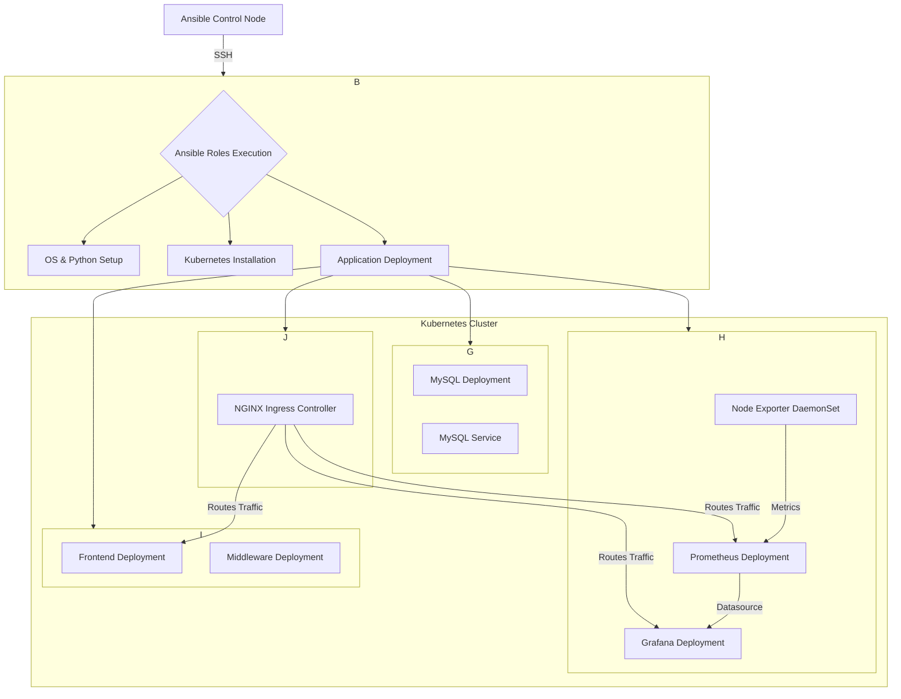

# SDV Setup: Ansible Deployment for a Full Application Stack on Kubernetes

## 1. Overview

This project provides a fully automated solution for deploying a multi-component application stack on a Kubernetes cluster using Ansible. It handles everything from the base operating system and Kubernetes setup to the deployment of a full monitoring suite, a MySQL database, and a frontend application.

## 2. Architecture Diagram



### Component Communication Flow:

1.  **Ansible & Target VM**: The Ansible control node connects to the target VM via SSH to execute the playbooks and roles.
2.  **Ansible & Kubernetes**: Ansible roles install `containerd.io`, `kubeadm`, `kubelet`, and `kubectl`, then initialize a Kubernetes cluster on the VM.
3.  **Application Stack**: Ansible then deploys the full application stack into different namespaces within the cluster:
    *   **`sdv`**: Contains the MySQL database.
    *   **`monitoring`**: Contains Prometheus, Grafana, and Node Exporter.
    *   **`midware`**: Contains the frontend and middleware applications.
    *   **`ingress-nginx`**: Contains the NGINX Ingress Controller.
4.  **Monitoring Data Flow**:
    *   `Node Exporter` runs on each node to collect system-level metrics.
    *   `Prometheus` scrapes metrics from Node Exporter.
    *   `Grafana` uses Prometheus as a data source to visualize the metrics.
5.  **Ingress Flow**:
    *   The `NGINX Ingress Controller` routes external traffic to the appropriate services within the cluster based on the hostname.

## 3. Project Structure

```
/home/pratikdhumane/ch-work/ansible-work/sdv-setup/
├───.gitignore
├───ansible.cfg
├───documentation.md
├───k8s_cleanup.sh
├───requirements.yml
├───group_vars/
│   └───all.yml
├───host_vars/
│   └───localhost.yml
├───inventories/
│   ├───dev
│   └───...
├───playbooks/
│   └───site.yml
└───roles/
    ├───OSdetection/
    ├───python/
    ├───k8s_setup/
    ├───pro-graf/
    ├───mysql/
    └───frontend/
```

## 4. Deployment Process

The entire deployment is orchestrated by the main playbook `playbooks/site.yml`. To run it:

```bash
ansible-playbook playbooks/site.yml
```

This will execute the roles in the following order:

1.  `OSdetection`: Detects the OS and sets up prerequisites.
2.  `python`: Installs Python.
3.  `k8s_setup`: Initializes the Kubernetes cluster.
4.  `pro-graf`: Deploys the Prometheus and Grafana monitoring stack, along with the NGINX Ingress Controller.
5.  `mysql`: Deploys the MySQL database.
6.  `frontend`: Deploys the frontend and middleware.

During the `pro-graf` role, you will be prompted to enter the public/elastic IP of the server. This is required to correctly configure the `/etc/hosts` file on your local machine for accessing the Grafana and Prometheus UIs.

## 5. Validation and Verification

Here’s how to check that all components have been deployed correctly inside the VM.

**Important:** When running `kubectl` commands on the server, you must use `sudo`.

### 5.1. Check All Pods

This command gives you a complete overview of all running applications across all namespaces.

```bash
sudo kubectl get pods -A
```

**Expected Output:**

You should see pods for `calico`, `coredns`, `etcd`, `kube-apiserver`, `kube-controller-manager`, `kube-proxy`, `kube-scheduler`, `grafana`, `node-exporter`, `prometheus`, `mysql`, `frontend`, and `middleware` in a `Running` state.

### 5.2. Check Deployments

Verify that the declarative state of your applications is healthy.

```bash
sudo kubectl get deployments -A
```

**Expected Output:**

Look for deployments for `grafana`, `prometheus`, `mysql`, `frontend`, and `middleware`, and ensure the `READY` column shows that all replicas are available (e.g., `1/1`).

### 5.3. Check Services

Check how the applications are exposed within and outside the cluster.

```bash
sudo kubectl get services -A
```

**Expected Output:**

You should see services for `kubernetes`, `grafana`, `prometheus`, and `mysql`.

### 5.4. Validate MySQL Database and User

1.  **Get the MySQL pod name:**

    ```bash
    POD_NAME=$(sudo kubectl get pods -n sdv -l app=mysql -o jsonpath='{.items[0].metadata.name}')
    ```

2.  **Connect to the pod and check the database and user:**

    ```bash
    sudo kubectl exec -n sdv $POD_NAME -- mysql -h 127.0.0.1 -P 3306 -u root -p'Pa$$W0Rd654' -e "SHOW DATABASES LIKE 'sdv_data'; SELECT user, host FROM mysql.user WHERE user = 'sdvuser';"
    ```

### 5.5. Accessing Services

To access the Grafana and Prometheus UIs, you must edit your **local** `/etc/hosts` file. The playbook will provide the exact instructions at the end of the run. The instructions will look like this:

```
####################################################################################
# To access the Grafana and Prometheus UIs, you must edit your LOCAL /etc/hosts file.
# Open the file with sudo privileges, for example: sudo nano /etc/hosts
#
# Add the following lines, then save and close the file:
#   <your-public-ip> sdv-grafana
#   <your-public-ip> sdv-prometheus
#
# After saving, you can access the UIs at:
#   Grafana: http://sdv-grafana
#   Prometheus: http://sdv-prometheus
#
# The Grafana admin password is saved in the logs/grafana_admin_password.txt file.
####################################################################################
```

## 6. Cleanup

To completely remove all resources and reset the VM to its pre-deployment state, use the cleanup script:

```bash
./k8s_cleanup.sh
```

This script will delete all the Kubernetes resources and reset the Kubernetes cluster.
